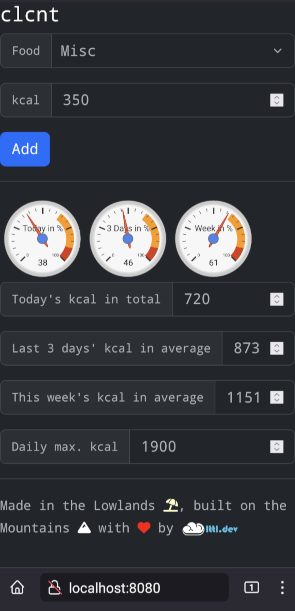
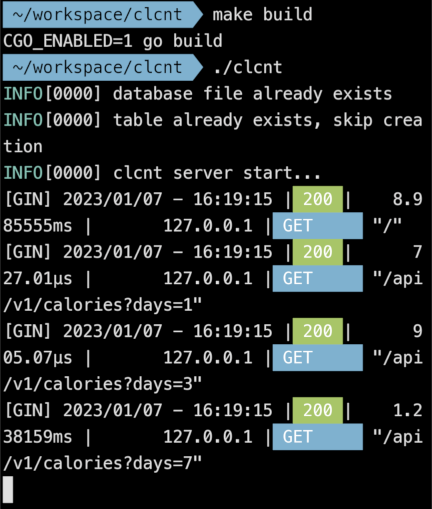

# clcnt

New year, old resolution...

A (nerdy) **c**a**l**ories **c**ou**nt**er which has a `go` backend and a web frontend, both intended to run locally on an Android smartphone (in my case a Pixel 6).
More precisely, the backend web and API server run on the phone's Linux shell while the phone's browser accesses this backend through `http://localhost:8080`.

In a nutshell, the application counts the calories as entered througout the day, per day. It shows today's accumulation, the average for 3 and 7 days:



(The magic number "1900" is the amount of calories I burn every day according to the experts. It can be changed in [here](templates/index.tmpl), just search for, well, "1900".)

As I like `go`, Linux (which is more or less ready to be used on my smartphone anyway) and experiments, I ended up implementing the app this way, i.e. not as a "traditional smartphone app" that can be loaded onto the phone, e.g. via a provider app store. 

All app data is stored locally and anonymously in a SQLite database which resides on the phone's Linux - no app data is supposed to leave the phone. The app doesn't use cookies either.
The frontend downloads JavaScript and stylesheets from third party CDNs. While the [lttl.dev](https://lttl.dev) logo is my own, the icons used are from [Font Awesome](https://fontawesome.com/). The gauges come in via a Google's library.

Disclaimer:
- This is a hobby project that I only use for my private purpose but which I wanted to share. Feel free to use it (for your inspiration).
- While there's some automation via `Makefile`, there's no installer, no ready-to-use, out-of-the-box, one-click solution. 
- Use at your own risk. There's no support, no warranty, no guarantee, nothing whatsoever. Your data and time loss, is your loss. Any potential damage is yours.
- Sources that I used are referenced, esp. listed below under bookmarks.
- I don't know what CDNs, or other apps/libs/... that are used here, see or store in terms of (meta) data resulting from running and using this app! However, I'm not suggesting anything here; it's just a disclaimer...
- I'm also not responsible for linked, external contents.

## prerequisites

### Runtime

- A Pixel 6 device (in my case, but could work with other Android phones as well) with [Termux](https://f-droid.org/en/packages/com.termux/) installed via [F-Droid](https://f-droid.org/).
- golang (1.19 in my case) installed on Termux ([1](https://www.techncyber.com/2022/12/golang-in-termux.html) and [2](http://rafalgolarz.com/blog/2017/01/15/running_golang_on_android/) are nice write ups.)
- [swag](https://github.com/swaggo/swag) `go install github.com/swaggo/swag/cmd/swag@latest`

## init & build

Run `make` to see what's doable.

## run

### dev

Invoke the following on your local development machine, e.g. a Linux or macOS shell, to ensure the Swagger documentation is up-to-date:

`make run`

OR

```
make build
./clcnt -debug
```

### production

Deployment: Download the project zip from [GitHub](https://github.com/m5lk3n/clcnt/archive/refs/heads/main.zip), unzip in Termux (just "open" the zip from Android and it'll ask what to do with it, choose Termux).

On the Termux shell run the following:

```
make build
./clcnt
```

It should look as follows (with an existing DB):



## usage (localhost)

### frontend

Browse to [localhost](http://localhost:8080), it should look like the first screenshot above. I tested with the most recent Chrome and Firefox versions at the time of writing.

### backend

Here's an exemplified extract of the backend API which is (partially) used by the frontend:

| Use case | Verb | URL |
| --- | --- | --- |
| Add breakfast entry with 350 calories | POST | localhost:8080/api/v1/entry/Breakfast/350 |
| Retrieve all entries | GET | localhost:8080/api/v1/entry |
| Get today's calories in total | GET | localhost:8080/api/v1/calories |
| Get 3 days calories average | GET | localhost:8080/api/v1/calories?days=3 |

For the full API documentation, see http://localhost:8080/swagger.

## backup & restore

This is your responsibility!
To back up and restore the underlying DB file, simply copy `clcnt.db`. To copy the DB file to the device's default storage (outside of Termux!), run the convenience script [backup-db.sh](scripts/backup-db.sh).
**Run a backup prior to every update!**

## bookmarks

Sources that I used / took inspiration from:

- [BUILDING AN APPLICATION WITH GO AND SQLITE](https://www.allhandsontech.com/programming/golang/how-to-use-sqlite-with-go/)
- [BUILDING A WEB APP WITH GO AND SQLITE](https://www.allhandsontech.com/programming/golang/web-app-sqlite-go/)
- [DB Browser for SQLite](https://sqlitebrowser.org/)
- [Epoch & Unix Timestamp Conversion Tools](https://www.epochconverter.com/)
- [Google Charts - Visualization: Gauge](https://developers.google.com/chart/interactive/docs/gallery/gauge)
- [Go and SQLite in the Cloud](https://www.golang.dk/articles/go-and-sqlite-in-the-cloud)
- [Companion app to "The Complete Guide to Go and SQLite"](https://github.com/maragudk/sqlite-app)
- [Use Rems for Font Size to Respect User Preferences](https://www.aleksandrhovhannisyan.com/blog/use-rems-for-font-size/)
- GitHub
- Stack Overflow

## known limitations

- There's no cross-compilation for the target platform (Pixel 6) from the development platform (macOS or Linux). Build locally instead.

## to do

- Add tests, incl. boundaries (backend)
- Show certain thresholds/achievements (e.g. calories saved this week) (as toasts)

## backlog

1. Build in auto-backup option
2. Rename to calcnt, "Count Cali", "Kali-nikta" or "Fat Dracula"?
3. Update entries
4. Delete specific entries
5. Delete old entries
6. Retrieve (certain) entries

As a workaround for now for
- 3.-5., use the [DB Browser for SQLite](https://sqlitebrowser.org/)
- 6., use the built-in Swagger interface under http://localhost:8080/swagger

## open

- Should [/docs](/docs) be checked in?
