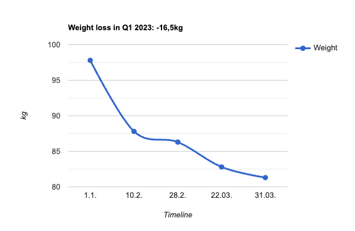

# result

16,5kg weight loss in 90 days just by counting calories...

## disclaimer

**Dieting can be life-threating!**

**You're responsible for your own health!**

**If you want or need to lose weight or think about it, consult a professional before!**

**In doubt, don't hesitate to get help!**

**The below reflects my approach - I do *not* recommend it to anyone!**

## goal

My 2023 resolution was to lose 10kg between New Year and Easter. That's in a bit more than 3 months.

As a male knowledge worker, I burn [1900](README.md) calories a day I was told - without sports.

So, my rough plan was to save 7000 calories (I read somewhere that this equals to a weight loss of 1kg, but I don't recall the source) every 7-10 days (through calories counting, not sports), i.e., ~4kg per max. 40 days (ideally per month) = ~12kg in a bit more than a quarter. As losing weight is not linear (loss is more/faster in the beginning, the curve flattens towards the end), I also gave myself 2kg of "buffer" so that I would end up at -10kg until Easter.

Then the math was simple: Stay below ~1200 calories per day...

## actual outcome

In the end, I lost 4,5kg more than planned:

Here's what I used to draw above's graph:

[RapidTables - Line Graph Maker](https://www.rapidtables.com/tools/line-graph.html)

| Line Graph Element | Value | 
| --- | --- |
| Graph title: | Weight loss in Q1 2023: -16,5kg |
| Horizontal axis: | Timeline |
| Vertical axis: | kg |
| Data values: | 1.1. 10.2. 28.2. 22.03. 31.03. |
| Line 1 data values: | 97.8 87.8 86.3 82.8 81.3 |

Milestones:
- -10kg in 41 days
- -15kg in 81 days
- -16,5kg in 90 days

## data

[clcnt.db](clcnt.db) holds my actual count: 87910 calories in 90 days, that's 977 per day.

For SQLite reference: `select sum(calories) from entries`

Interpretation: As the only sports I did during that time was a bit of cycling, I either burn more than 1900 calories a day and/or it doesn't take me 7000 calories to lose a kilo.
